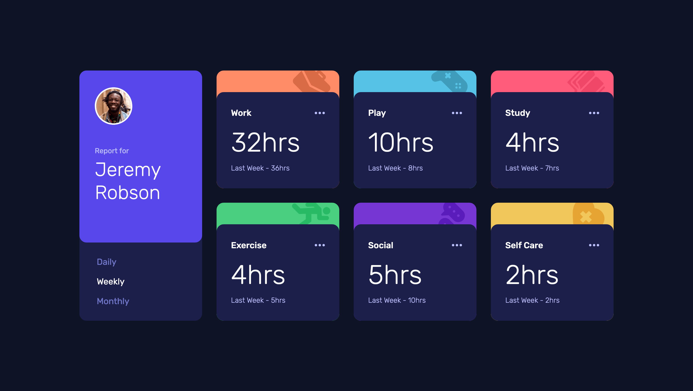

# Frontend Mentor - Time tracking dashboard solution

This is a solution to the [Time tracking dashboard challenge on Frontend Mentor](https://www.frontendmentor.io/challenges/time-tracking-dashboard-UIQ7167Jw). Frontend Mentor challenges help you improve your coding skills by building realistic projects.

## 目次

-   [概要](#概要)
    -   [チャレンジ](#チャレンジ)
    -   [スクリーンショット](#スクリーンショット)
    -   [リンク](#リンク)
-   [プロセス](#プロセス)
    -   [使用したスキル](#使用したスキル)
    -   [学んだこと](#学んだこと)
    -   [役に立ったリソース](#役に立ったリソース)

## 概要

### チャレンジ

ユーザーができること:

-   ユーザーの画面サイズによって最適なレイアウトが表示される
-   ページ上の全てのインタラクティブな要素にホバー状態を見ることができる
-   デイリー, ウィークリー, マンスリーの統計を切り替えることができる

### スクリーンショット



### リンク

-   Live Site URL: [リンク](https://your-live-site-url.com)

## プロセス

### 使用したスキル

-   CSS custom properties
-   Sass
-   Vanilla JavaScript
-   Flexbox
-   CSS Grid
-   モバイルファースト

### 学んだこと

fetch メソッドを使い JSON データを取得する方法について学ぶことができた。

コードスニペット:

```js
const fetchData = () => {
	fetch('../data.json')
		.then((response) => response.json())
		.then((data) => (json = data));
};
```

### 役に立ったリソース

-   [リソース 1](https://www.udemy.com) - Jonas Schmedtmann さんの "The Complete JavaScript Course 2022: From Zero to Expert!" で学んだ。
